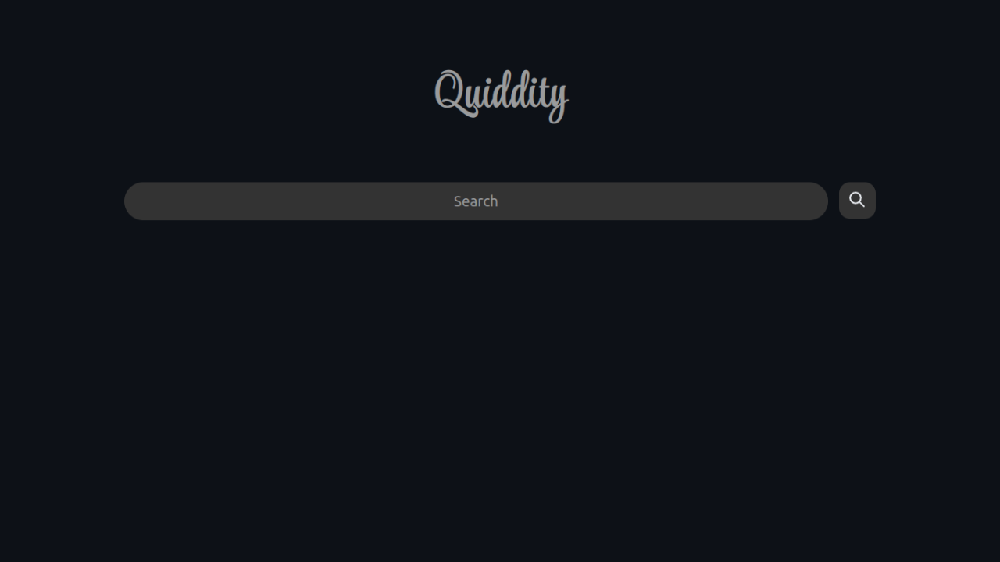

<!-- cspell:words Mehedi Hasan nytly startpage -->

# Quiddity

Quiddity is a very bare-bones startpage.

## Authors

Mehedi Hasan (@0xMehedi) and the [contributors](https://github.com/0xMehedi/quiddity/graphs/contributors).

## Features

- Supports Firefox and Chromium

- Optimized for Speed

- Cross Platform

- Mobile Friendly

## Screenshots

## Demo

Live Demo for Quiddity is [available here](https://0xMehedi.github.io/quiddity/).

## Contributing

Contributions are always welcome.

Check out the [Contribution Guide](./CONTRIBUTING.md) for more info.

## Support

Feel free to [open an issue](https://github.com/0xMehedi/quiddity/issues/new/choose) if you encounter any problem related to _Quiddity_.

## License

_Quiddity_ is released under the [AGPL License](./LICENSE).

## Appendix

Built with :heart: in Bangladesh.
